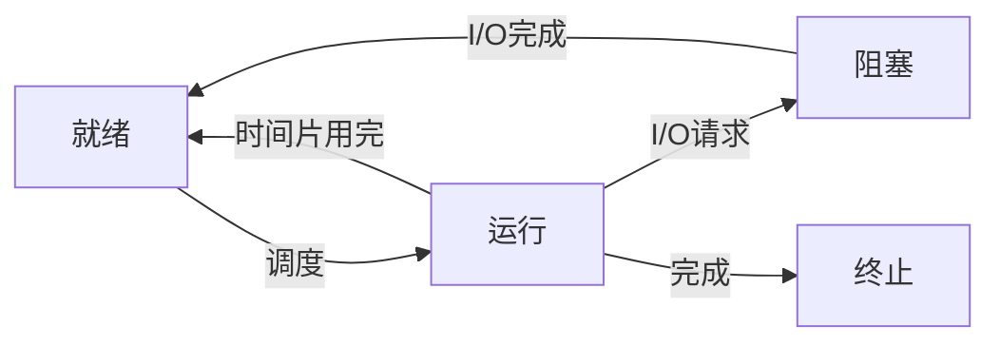

# 操作系统核心概念：进程与线程详解

进程和线程是操作系统中最重要的两个概念，理解它们的区别和联系对于成为一名优秀的程序员至关重要。本文将深入探讨这两个核心概念。

## 什么是进程？

进程是操作系统资源分配的基本单位，是程序在执行过程中的一个实例。每个进程都有自己独立的内存空间、文件描述符、堆栈等资源。

### 进程的特性

- **独立性**：每个进程都有自己独立的地址空间，进程间通信需要特殊的机制（IPC）
- **动态性**：进程是程序的一次执行过程，具有生命周期
- **并发性**：多个进程可以同时存在于系统中，并发执行
- **结构性**：进程由程序段、数据段和进程控制块（PCB）组成

### 进程的状态



1. **就绪状态**：进程已获得除CPU外的所有资源
2. **运行状态**：进程正在CPU上执行
3. **阻塞状态**：进程等待某个事件发生

## 什么是线程？

线程是CPU调度的基本单位，是进程中的一个执行路径。同一进程内的多个线程共享该进程的资源。

### 线程 vs 进程

| 特性 | 进程 | 线程 |
|------|------|------|
| 资源拥有 | 独立地址空间 | 共享进程资源 |
| 通信方式 | IPC（管道、消息队列等） | 共享内存 |
| 上下文切换 | 慢（需要切换地址空间） | 快 |
| 创建销毁开销 | 大 | 小 |
| 数据共享 | 困难 | 容易 |

## 进程间通信（IPC）

由于进程间内存独立，需要特殊机制进行通信：

### 1. 管道（Pipe）

```c
// 匿名管道示例
#include <unistd.h>
int pipefd[2];
pipe(pipefd);  // 创建管道
// pipefd[0] 用于读，pipefd[1] 用于写
```

### 2. 消息队列

消息队列是保存在内核中的消息链表，有权限的进程可以向队列中添加消息，被赋予读权限的进程则可以从队列中读取消息。

### 3. 共享内存

共享内存是最快的IPC方式，多个进程将同一块物理内存映射到各自的虚拟地址空间。

```c
// 共享内存示例
#include <sys/shm.h>
int shmid = shmget(key, size, IPC_CREAT | 0666);
char *shm = shmat(shmid, NULL, 0);
```

### 4. 信号量

信号量本质上是一个计数器，用于控制多个进程对共享资源的访问。

## 线程同步

多线程编程中，必须考虑线程安全问题：

### 1. 互斥锁（Mutex）

```python
import threading

lock = threading.Lock()

def critical_section():
    lock.acquire()
    try:
        # 临界区代码
        pass
    finally:
        lock.release()
```

### 2. 信号量（Semaphore）

```python
import threading

semaphore = threading.Semaphore(3)  # 最多3个线程同时访问

def access_resource():
    with semaphore:
        # 访问共享资源
        pass
```

### 3. 条件变量（Condition）

```python
import threading

condition = threading.Condition()

def consumer():
    with condition:
        while not item_available:
            condition.wait()
        # 消费物品
        condition.notify()

def producer():
    with condition:
        # 生产物品
        condition.notify()
```

## 进程调度算法

操作系统需要决定哪个进程在何时运行：

### 1. 先来先服务（FCFS）

最简单的调度算法，按进程到达的顺序进行调度。

### 2. 短作业优先（SJF）

选择估计运行时间最短的进程优先执行。

### 3. 时间片轮转（Round Robin）

每个进程被分配一个时间片，时间片用完后被剥夺CPU。

### 4. 优先级调度

每个进程分配一个优先级，优先级高的进程优先执行。

## 实践建议

### 何时使用多进程？

- CPU密集型任务
- 需要隔离性的场景
- 需要充分利用多核CPU

### 何时使用多线程？

- I/O密集型任务
- 需要共享大量数据
- 需要快速响应

### 性能优化技巧

1. **避免过度同步**：减少锁的粒度和持有时间
2. **使用线程池**：避免频繁创建销毁线程
3. **考虑无锁编程**：使用原子操作和CAS
4. **合理设置进程/线程数**：通常设置为CPU核心数的1-2倍

## 总结

- 进程是资源分配的单位，线程是CPU调度的单位
- 进程间通信需要特殊机制，线程间可以直接共享内存
- 多进程适合CPU密集型，多线程适合I/O密集型
- 合理使用同步机制避免竞态条件

理解并正确使用进程和线程，是编写高效并发程序的基础。
